# CS305 SDN Controller Project Report


## 1. Project Overview

This project implements a centralized SDN controller based on os-ken and Mininet. The controller supports DHCP address allocation, shortest-path switching, firewall filtering, and bonus features including DHCP lease management, duplicate IP prevention, and switchable routing algorithms.

### 1.1 Project Architecture

```text
CS305-2026Spring-Project
|-- controller.py
|   |-- topology event handling
|   |-- ARP handling
|   |-- shortest-path switching
|   |-- routing algorithm selection
|   `-- firewall rule installation
|-- dhcp.py
|   |-- DHCP DISCOVER/OFFER
|   |-- DHCP REQUEST/ACK
|   |-- DHCP lease management
|   `-- duplicate IP prevention
|-- firewall.py
|   |-- firewall rule loading
|   |-- rule normalization
|   `-- drop flow installation
|-- firewall_rule.json
`-- tests
    |-- dhcp_test
    |-- switching_test
    |-- firewall_test
    `-- complex_test
```

### 1.2 Architecture Description

`controller.py` is the entry point of the SDN controller. It receives PacketIn messages and topology events from switches, updates the global network state, and installs OpenFlow rules. `dhcp.py` implements the DHCP server logic. `firewall.py` parses firewall rules and installs high-priority drop rules. The `tests` directory contains Mininet topologies for verifying DHCP, switching, firewall, and complex-topology behavior.

## 2. DHCP Implementation

### 2.1 Design

The DHCP module is implemented in `dhcp.py`. The controller receives DHCP packets in `controller.py` and dispatches them to `DHCPServer.handle_dhcp`.

The basic DHCP packet flow is:

```text
DHCP DISCOVER -> DHCP OFFER
DHCP REQUEST  -> DHCP ACK
```

The default address pool is:

```text
start_ip = 192.168.1.2
end_ip   = 192.168.1.100
netmask  = 255.255.255.0
```

The DHCP reply also includes server identifier, subnet mask, gateway, DNS server, and lease time options.

### 2.2 Key Implementation

Important functions in `dhcp.py`:

```text
DHCPServer.handle_dhcp
DHCPServer.assemble_offer
DHCPServer.assemble_ack
DHCPServer._assemble_reply
```

`handle_dhcp` distinguishes DHCP message types and sends the corresponding DHCP reply. `assemble_offer` and `assemble_ack` construct the DHCP OFFER and ACK packets, while `_assemble_reply` fills the Ethernet, IPv4, UDP, and DHCP fields.

### 2.3 Test Result

Test command:

```bash
osken-manager --observe-links controller.py
cd tests/dhcp_test
sudo env "PATH=$PATH" python test_network.py
```

Expected result:

```text
h1 receives a valid IP address.
h2 receives a different valid IP address.
Both addresses are in the DHCP pool.
```

Actual result:

```text
h1 received 192.168.1.2/24.
h2 received 192.168.1.3/24.
Both addresses are within the DHCP pool and are not duplicated.
```

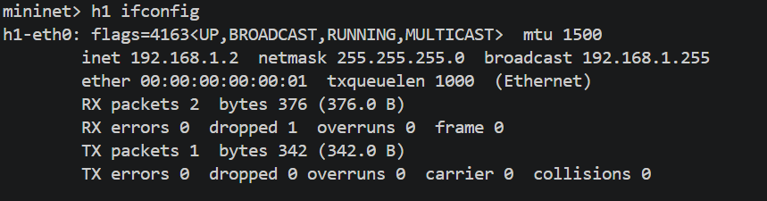
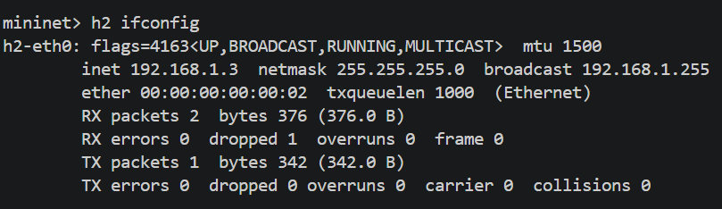

## 3. Shortest-Path Switching

### 3.1 Design

The switching module is implemented in `controller.py`. The controller listens to switch, host, link, and port events, then maintains a global topology graph.

Main data structures:

```text
switches      : all known switches
links         : switch-to-switch adjacency table
hosts_by_mac  : host MAC -> attachment switch/port/IP
mac_by_ip     : host IP -> host MAC
```

When a host is learned or the topology changes, the controller recomputes paths and installs forwarding rules. The flow rules match destination MAC addresses and output packets to the correct port.

### 3.2 ARP Handling

The controller handles ARP requests directly instead of flooding them. When the target IP is known, the controller sends an ARP reply back to the sender. This allows hosts to learn destination MAC addresses while the controller still controls forwarding behavior.

Key implementation points in `controller.py`:

```text
packet_in_handler
_handle_arp
_learn_host
_recompute_paths
_install_mac_flow
```

### 3.3 Test Result

Test command:

```bash
osken-manager --observe-links controller.py
cd tests/switching_test
sudo env "PATH=$PATH" python test_network.py
```

Mininet command:

```bash
pingall
```

Expected result:

```text
*** Results: 0% dropped
```

Actual result:

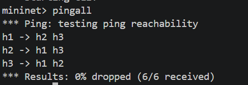

Controller path log:

After hosts and links were learned, the controller printed the active routing algorithm and the computed paths between hosts. In the triangle topology, all three hosts were connected through the shortest switch paths. The final stable path table contains paths for all ordered host pairs.

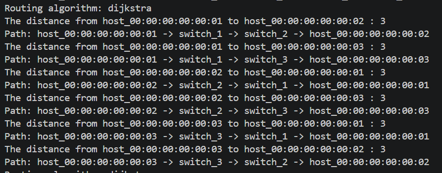

Some intermediate logs may show temporary paths with longer distances because the controller recomputes paths while topology discovery is still in progress. After all links are discovered, the stable paths match the expected shortest paths in the triangle topology.

## 4. Firewall Implementation

### 4.1 Design

The firewall module is implemented in `firewall.py`. It reads rules from `firewall_rule.json`, normalizes wildcard fields, converts protocol names to protocol numbers, and installs high-priority drop flow entries.

Each firewall rule may contain:

```text
src_ip
dst_ip
proto
src_port
dst_port
action
```

For `deny` rules, the controller installs a flow entry with an empty action list. Therefore, packets matching the rule are dropped directly by the switch.

### 4.2 Firewall Rules

| Source IP | Destination IP | Protocol | Destination Port | Action |
|---|---|---|---|---|
| 192.168.117.2 | 192.168.117.3 | ICMP | any | deny |
| 192.168.117.2 | 192.168.117.3 | TCP | 80 | deny |

These rules block ICMP traffic from `h1` to `h2` and TCP traffic from `h1` to `h2` on port `80`. Other traffic, such as ICMP from `h1` to `h3` and TCP traffic from `h1` to `h2` on port `8080`, should still be allowed.

### 4.3 Test Result

Test command:

```bash
osken-manager --observe-links controller.py
cd tests/firewall_test
sudo env "PATH=$PATH" python test_network.py
```

Expected result:

```text
h1 -> h2 ICMP      should fail
h1 -> h3 ICMP      should pass
h1 -> h2 TCP/80    should fail
h1 -> h2 TCP/8080  should pass
```

Actual result:

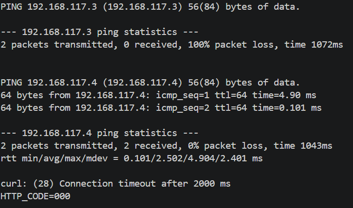

The result matches the expected firewall behavior. ICMP and TCP/80 traffic from `h1` to `h2` were blocked, while unrelated ICMP traffic and TCP/8080 traffic were allowed.

## 5. Bonus Features

### 5.1 Bonus A: DHCP Lease Management and Duplicate IP Prevention

#### 5.1.1 Design

The DHCP server maintains explicit lease state for every allocated address.

Main data structures:

```text
leases_by_mac      : MAC -> lease
leases_by_ip       : IP -> lease
declined_ip_until  : temporarily blocked IPs after DHCP DECLINE
allocated_ip       : compatibility map, MAC -> IP
ip_to_mac          : compatibility map, IP -> MAC
lease_expiration   : compatibility map, MAC -> expiration time
```

Each lease stores:

```text
mac
ip
state
xid
expires_at
lease_time
```

The DHCP server supports:

```text
DHCP OFFER with temporary OFFERED state
DHCP ACK with BOUND state
DHCP NAK for invalid or conflicting requested IP
DHCP RELEASE to remove a lease
DHCP DECLINE to temporarily block a declined IP
Lease expiration and address reuse
```

#### 5.1.2 Lease Time Test

Command:

```bash
h1 grep dhcp-lease-time /var/lib/dhcp/dhclient*.leases
```

Actual result:

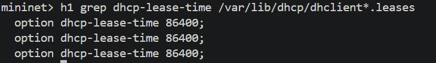

The lease file contains `option dhcp-lease-time 86400`, proving that the DHCP server sends the lease duration option.

#### 5.1.3 Release and Reallocation Test

Commands:

```bash
h1 dhclient -r -v h1-eth0
h1 ip addr show h1-eth0
h1 dhclient -v -1 h1-eth0
h1 ifconfig
h2 ifconfig
```

Expected result:

```text
h1 sends DHCPRELEASE.
h1 has no IPv4 address after release.
h1 receives a valid IP address again after DHCPDISCOVER.
h1 and h2 do not receive duplicate IP addresses.
```

Release success:

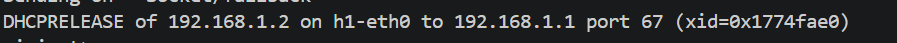

After release, `h1-eth0` no longer has an IPv4 address:

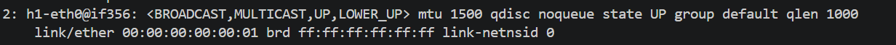

Then `h1` sends DHCPDISCOVER again and receives DHCPOFFER and DHCPACK for `192.168.1.2`:

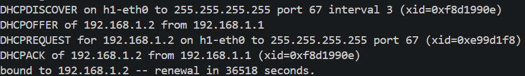

Finally, `h1` and `h2` still have different IP addresses:

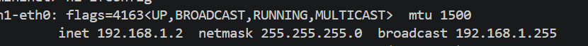
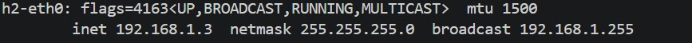

This verifies DHCP lease release, reallocation, and duplicate IP prevention.

### 5.2 Bonus B: Switchable Routing Algorithms

#### 5.2.1 Design

The controller supports two shortest-path algorithms:

```text
dijkstra
bellman_ford
```

The algorithm is selected using the environment variable:

```text
CS305_ROUTING_ALGORITHM
```

If the environment variable is not set, the controller uses Dijkstra by default.

Key implementation points in `controller.py`:

```text
_select_routing_algorithm
_shortest_switch_path
_dijkstra_switch_path
_bellman_ford_switch_path
```

#### 5.2.2 Dijkstra Test

Controller command:

```bash
osken-manager --observe-links controller.py
```

Test command:

```bash
cd tests/complex_test
sudo env "PATH=$PATH" python test_network.py
```

Expected result:

```text
Routing algorithm: dijkstra
*** Results: 0% dropped
```

Actual result:

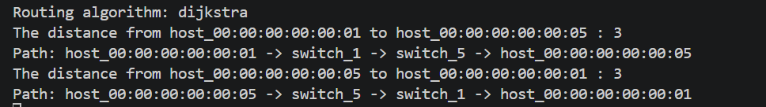


#### 5.2.3 Bellman-Ford Test

Controller command:

```bash
CS305_ROUTING_ALGORITHM=bellman_ford osken-manager --observe-links controller.py
```

Test command:

```bash
cd tests/complex_test
sudo env "PATH=$PATH" python test_network.py
```

Expected result:

```text
Routing algorithm: bellman_ford
*** Results: 0% dropped
```

Actual result:


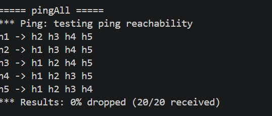

Both routing algorithms passed the complex topology test with no packet loss.

## 6. Complex Testcase

### 6.1 Topology

The complex testcase is implemented in:

```text
tests/complex_test/test_network.py
```

Topology:

```text
h1--s1--s2--h2
|  / |   /|
| /  |  / |
s5--s3--s4
|    |    |
h5   h3   h4
```

The switch graph contains a ring and extra cross links:

```text
Ring:
s1-s2-s3-s4-s5-s1

Cross links:
s1-s3
s2-s5
```

This topology is non-tree and contains loops and multiple available paths.

### 6.2 Test Procedure

The test script performs:

```text
1. Build five hosts and five switches.
2. Disable IPv6 to avoid unrelated traffic.
3. Send gratuitous ARP from all hosts.
4. Run pingAll.
5. Run selected host-to-host ping tests.
```

### 6.3 Test Result

Expected result:

```text
pingAll: 0% dropped
selected pings: 0% packet loss
```

Actual result:

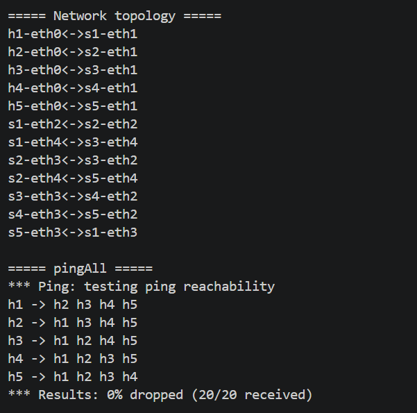

All selected host-to-host ping tests also achieved `0% packet loss`. One example is shown below:

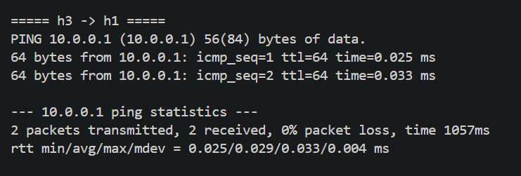

The complex testcase demonstrates that the controller can handle a looped, non-tree topology with multiple available paths.

## 7. Conclusion

This project implements a centralized SDN controller that supports DHCP address allocation, shortest-path switching, firewall filtering, DHCP lease management, duplicate IP prevention, and switchable routing algorithms. The DHCP tests confirm valid address allocation, lease duration, release, reallocation, and duplicate IP prevention. The switching and firewall tests confirm correct forwarding and packet filtering. The complex topology tests show that both Dijkstra and Bellman-Ford can compute valid shortest paths in a looped multi-path topology.
